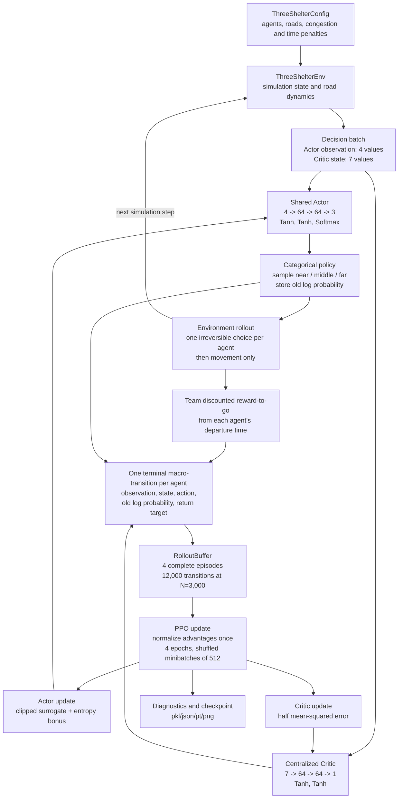

# Three-shelter MAPPO: code architecture and mathematical specification

This document describes the **capacity-free, blockage-free three-shelter
experiment** implemented by `three_shelter_env.py` and
`three_shelter_training.py`. It is intended to make the implementation easy to
explain and audit. It describes what the current code actually computes; it
does not describe planned capacity or blockage extensions.

## 1. System architecture



The implementation follows centralized training with decentralized execution
(CTDE):

- All agents use one parameter-shared Actor.
- The Actor receives only the 4-dimensional decision observation.
- A single centralized Critic receives a richer 7-dimensional global state.
- During execution, a shelter can be selected from the Actor alone; the Critic
  is needed only during training.
- Cooperation is induced by the system-wide mean discounted reward-to-go used
  as the learning target.

This is called MAPPO because many agents contribute transitions to a shared
policy and a centralized value function. It is not 3,000 separately stored
Actor networks.

## 2. Model and network dimensions

### Environment

| Quantity | Current value |
|---|---:|
| Agents per episode | 3,000 |
| Episode horizon | 900 one-second steps |
| Departure interval | integer steps 0 through 224 |
| Near road | 150 m x 5 m |
| Middle road | 225 m x 5 m |
| Far road | 300 m x 5 m |
| Free density | 0.1 agents/m2 |
| Maximum/reference density | 1.0 agents/m2 |
| Free-flow base speed | Uniform(1.0, 1.5) m/s per agent |
| Minimum speed factor | 0.3 |
| Congestion penalty coefficient | 0.50 |
| Time penalty per active step | 0.01 |

There are no shelter-capacity limits, no road closure, and no action mask in
this version.

### Actor

```text
[near density, middle density, far density, remaining waiting fraction]
        -> Linear(4,64) -> Tanh
        -> Linear(64,64) -> Tanh
        -> Linear(64,3) -> Softmax
        -> [P(near), P(middle), P(far)]
```

The Actor has 4,675 trainable parameters.

### Critic

```text
[3 normalized densities,
 3 fractions of all agents currently travelling on the roads,
 remaining waiting fraction]
        -> Linear(7,64) -> Tanh
        -> Linear(64,64) -> Tanh
        -> Linear(64,1)
        -> scalar V(s)
```

The Critic has 4,737 trainable parameters.

## 3. File and function map

### `three_shelter_env.py` - simulation model

- `ThreeShelterConfig`: immutable environment parameters such as population,
  horizon, road geometry, speed range, and reward coefficients.
- `ThreeShelterEnv.__init__`: validates configuration, creates the random
  generator, and precomputes road lengths and areas.
- `_validate_config`: rejects invalid population, geometry, density, departure,
  or speed settings.
- `reset`: samples departure steps and free-flow speeds, then initializes every
  agent and every episode accumulator.
- `normalized_density`: returns the three road densities divided by the
  reference maximum density and clipped to `[0,1]`.
- `action_mask`: returns three `True` values because all shelters are always
  selectable in the capacity-free model.
- `observations_for`: constructs the 4-dimensional Actor observation and the
  7-dimensional centralized Critic state.
- `decision_batch`: finds all waiting agents whose departure time equals the
  current simulation step and returns their observations/states.
- `commit`: records each departing agent's one irreversible shelter choice and
  changes the agent from waiting to travelling.
- `advance`: computes road densities, rewards, density-dependent speeds,
  movement, and arrivals for one simulation step.
- `team_discounted_reward_to_go`: backward recursion over the episode-level
  team reward sequence.
- `finished`: stops at 900 steps or when no waiting/travelling agents remain.
- `finalize`: marks remaining agents as failures and calculates returns,
  arrival times, failure counts, and route fractions.

### `three_shelter_training.py` - MAPPO training

- `require_finite`: immediately raises an error if any checked tensor/array
  contains NaN or infinity.
- `Actor`: shared 4-64-64-3 policy network with categorical output.
- `Critic`: centralized 7-64-64-1 value network.
- `PPOConfig`: all PPO hyperparameters and entropy settings.
- `generalized_advantage_estimate`: expresses the terminal-transition TD/GAE
  calculation. Because `done=1` and `next_value=0`, there is no temporal GAE
  recursion and lambda has no numerical effect.
- `RolloutBuffer`: holds exactly four complete episodes and concatenates them
  into one update batch.
- `MAPPOAgent.__init__`: creates both networks and separate Adam optimizers.
- `MAPPOAgent.act`: converts Actor probabilities into a categorical
  distribution, samples actions, and records old log probabilities.
- `MAPPOAgent.entropy_coefficient`: implements constant or linear annealing.
- `MAPPOAgent.update`: computes normalized advantages, four PPO epochs, the
  clipped Actor objective, entropy bonus, Critic loss, gradient clipping, and
  PPO diagnostics.
- `collect_episode`: runs one full simulation, creates one terminal
  macro-transition per agent, and calculates each agent's team reward-to-go
  target from its departure time.
- `parse_args`: defines the training command-line interface.
- `choose_device`: selects CPU or CUDA.
- `make_run_directory`: creates a timestamped run directory.
- `resolve_checkpoint`: accepts either a run directory or checkpoint path.
- `save_checkpoint`: atomically replaces one rolling checkpoint after a safe
  PPO-update boundary.
- `restore_checkpoint`: restores networks, optimizers, counters, and every
  relevant random-number-generator state.
- `append_metrics`: appends selected diagnostic values.
- `main`: assembles configuration, handles new/resumed runs, executes the
  episode/update loop, saves outputs, and removes the rolling checkpoint after
  successful completion.

### `evaluate_three_shelter_fixed.py` - fixed-policy baseline

- `probability_grid`: enumerates every fixed `(P_near,P_middle,P_far)` triplet
  on the requested simplex grid.
- `run_episode`: evaluates one fixed categorical policy without learning.
- `aggregate`: calculates the mean and sample standard deviation over
  evaluation seeds.
- `main`: performs the complete sweep, selects the highest-return fixed policy,
  and saves a ternary-style plot and JSON results.

This file supplies an external benchmark. Its best probability is not passed
to the Actor during training.

### `plot_three_shelter_diagnostics.py` - one-run diagnostics

- `resolve_diagnostics`: finds a requested or most recently modified
  `diagnostics.pkl`.
- `moving_average`: computes rolling means for readable curves.
- `main`: plots episode return, arrival time, sampled route fractions, losses,
  entropy, and mean Actor probabilities.

### `three_shelter_seed_convergence.py` - robustness across training seeds

- `rolling_mean`, `tail_mean`, `sample_std`: summary utilities.
- `_matching_configuration`: prevents runs with different environment/PPO
  settings from being mixed.
- `_files_under`: recursively discovers diagnostics or checkpoints.
- `load_completed_runs`: finds matching completed runs and selects the newest
  one for each seed.
- `load_resumable_runs`: finds matching rolling checkpoints.
- `train_missing_runs`: skips completed seeds, resumes interrupted seeds, and
  trains only missing seeds.
- `main`: compares the four training seeds and saves a six-panel plot plus a
  JSON summary of final-100-episode statistics.

### `test_three_shelter.py` - automated verification

- `test_network_shapes_and_probabilities`: verifies Actor/Critic dimensions and
  probability normalization.
- `test_environment_observation_and_actions`: verifies observation/state sizes
  and the three-action mapping.
- `test_rollout_requires_four_complete_episodes`: verifies buffer boundaries
  and concatenation.
- `test_learning_rates_and_entropy_schedule`: verifies both learning rates and
  entropy annealing values.
- `test_episode_has_one_transition_per_agent`: verifies exactly one stored
  decision per agent and finite episode data.
- `test_update_changes_actor_and_is_finite`: verifies a PPO update changes the
  Actor and produces finite diagnostics.
- `test_single_atomic_checkpoint_can_restore`: verifies single-file atomic
  replacement and exact model restoration.

### `THREE_SHELTER_README.md`

Records the experimental assumptions and exact commands for the fixed sweep,
training, resume, four-seed robustness run, plotting, and tests.

## 4. Mathematical computation, step by step

### Step 1: initialize one episode

For agent `i`, the departure step and free-flow speed are sampled as

```math
\tau_i \sim \text{DiscreteUniform}\{0,\ldots,224\},
\qquad
v_i^0 \sim \mathcal{U}(1.0,1.5).
```

Each agent is initially waiting. It receives exactly one action when
`t = tau_i` and never changes routes afterward.

### Step 2: calculate road densities and observations

For road `e` in `{near,middle,far}`, let `n_e(t)` be its number of travelling
agents, `L_e` its length, and `w=5 m` its width. Its area and physical density
are

```math
A_e=L_e w,
\qquad
\rho_e(t)=\frac{n_e(t)}{A_e}.
```

The density feature is

```math
\widetilde{\rho}_e(t)
=\operatorname{clip}\left(\frac{\rho_e(t)}{\rho_{\max}},0,1\right),
\qquad \rho_{\max}=1.0.
```

Let `N=3000`, `N_wait(t)` be the number still waiting, and

```math
f_{wait}(t)=\frac{N_{wait}(t)}{N}.
```

The decentralized Actor observation is

```math
o_t=
[\widetilde{\rho}_{near},
 \widetilde{\rho}_{middle},
 \widetilde{\rho}_{far},
 f_{wait}].
```

The centralized Critic additionally sees the road occupancy fractions
`x_e(t)=n_e(t)/N`:

```math
s_t=
[\widetilde{\rho}_{near},
 \widetilde{\rho}_{middle},
 \widetilde{\rho}_{far},
 x_{near},x_{middle},x_{far},f_{wait}].
```

Agents departing in the same step receive the same global observation and
state. Agent-specific speed is deliberately not an Actor input.

### Step 3: Actor forward pass and shelter choice

With Actor parameters `theta`, two hidden layers calculate

```math
h_1=\tanh(W_1o_t+b_1),
\qquad
h_2=\tanh(W_2h_1+b_2),
```

followed by

```math
\pi_\theta(a\mid o_t)
=\operatorname{softmax}(W_3h_2+b_3).
```

The action is sampled, not selected by argmax:

```math
a_i\sim\operatorname{Categorical}(\pi_\theta(\cdot\mid o_{\tau_i})).
```

The code stores `a_i` and the behavior-policy log probability

```math
\log \pi_{\theta_{old}}(a_i\mid o_{\tau_i}).
```

That stored value remains fixed throughout all four PPO epochs.

### Step 4: density-dependent movement

The speed calculation uses the **previous simulation step's density**. Define

```math
b_e(t-1)=\operatorname{clip}\left(
\frac{\rho_e(t-1)/\rho_{max}-\rho_{free}/\rho_{max}}
{1-\rho_{free}/\rho_{max}},0,1\right),
```

where `rho_free=0.1`. The speed factor and distance increment are

```math
q_e(t)=1-(1-q_{min})b_e(t-1),
\qquad q_{min}=0.3,
```

```math
\Delta d_i(t)=v_i^0 q_{a_i}(t)\Delta t,
\qquad \Delta t=1\text{ second}.
```

An agent arrives when its accumulated distance reaches the selected road
length. Because the route choice is irreversible, movement steps do not create
additional policy transitions.

### Step 5: individual diagnostic reward and team training reward

For an active agent on edge `e`, the normalized excess congestion is

```math
c_e(t)=\min\left(
\max\left(0,
\frac{\rho_e(t)/\rho_{max}-\rho_{free}/\rho_{max}}
{1-\rho_{free}/\rho_{max}}
\right),1\right).
```

Its step reward is

```math
r_{i,t}=-0.50c_{a_i}(t)-0.01.
```

Thus every second spent travelling costs at least `0.01`, and congestion adds
up to `0.50` per active second. The diagnostic episode return reported in the
plots is

```math
\overline{R}_{episode}
=\frac{1}{N}\sum_{i=1}^{N}\sum_t r_{i,t},
```

without temporal discounting.

For policy learning, the code first forms the population-normalized team reward

```math
\bar r_t=\frac{1}{N}\sum_{i\in active(t)}r_{i,t}.
```

The return target assigned to agent `i` is the discounted team reward-to-go
from that agent's own departure time:

```math
G_i=\sum_{k=\tau_i}^{T-1}\gamma^{k-\tau_i}\bar r_k,
\qquad \gamma=0.99.
```

Consequently, a route choice is credited for its effect on the subsequent
system-wide outcome, not merely that agent's private travel time.

**Important distinction:** `mean_episode_return_per_agent` and
`mean_training_return_target` are related but are not the same quantity. The
first is the mean undiscounted individual return used for diagnosis; the second
is the mean discounted team reward-to-go used to train MAPPO.

### Step 6: terminal macro-transition and advantage

One stored transition represents the entire consequence of one shelter choice:

```math
(o_i,s_i,a_i,\log\pi_{old}(a_i\mid o_i),G_i,done_i=1).
```

The standard temporal-difference residual is

```math
\delta_i=G_i+\gamma(1-done_i)V(s'_i)-V_\phi(s_i).
```

Here `done_i=1` and the code supplies `V(s'_i)=0`, so

```math
\delta_i=G_i-V_\phi(s_i).
```

There is no following decision belonging to the same agent. Therefore there is
no recursive GAE chain and

```math
\widehat A_i=G_i-V_{\phi_{old}}(s_i).
```

Although `gae_lambda=0.95` remains in the configuration and standard function
signature, lambda has no numerical effect in this one-terminal-transition
formulation. The return target remains exactly `G_i`.

### Step 7: collect a complete PPO batch

Four full episodes are collected before an update:

```math
B=4\times3000=12000\text{ transitions}.
```

No simulation time step after the shelter choice is stored as another action.
The batch is complete-agent data, not a truncated time rollout.

Immediately before PPO epochs, the current Critic is evaluated once and the
advantages are normalized over the complete 12,000-transition batch:

```math
\widehat A_i^{norm}
=\frac{\widehat A_i-\mu_{\widehat A}}
{\sigma_{\widehat A}+10^{-5}}.
```

These normalized advantages and old log probabilities stay fixed throughout
the four PPO epochs.

### Step 8: PPO probability ratio

At an update, the new Actor produces a new probability for the action that was
actually sampled. The importance ratio is

```math
r_i(\theta)=
\frac{\pi_\theta(a_i\mid o_i)}
{\pi_{\theta_{old}}(a_i\mid o_i)}
=\exp(\log\pi_\theta-\log\pi_{\theta_{old}}).
```

With `epsilon=0.2`, the clipped surrogate is

```math
L_i^{clip}(\theta)=\min\left(
r_i(\theta)\widehat A_i^{norm},
\operatorname{clip}(r_i(\theta),0.8,1.2)\widehat A_i^{norm}
\right).
```

Clipping limits the incentive for one update to move the selected action's
probability too far from the behavior policy.

### Step 9: entropy-regularized Actor objective

For the three-action categorical policy,

```math
H(\pi_\theta(\cdot\mid o_i))
=-\sum_{a=1}^{3}\pi_\theta(a\mid o_i)
\log\pi_\theta(a\mid o_i).
```

The maximum possible entropy is `ln(3)=1.098612...`. The minimized Actor loss is

```math
\mathcal L_{actor}
=-\mathbb E_i[L_i^{clip}(\theta)]
-\beta H(\pi_\theta).
```

For annealed training,

```math
\beta(e)=0.05+min\left(\frac{e}{9000},1\right)(0.01-0.05).
```

It decreases linearly from `0.05` to `0.01` by episode 9,000 and then remains
at `0.01`. Because this is a loss being minimized, the negative entropy term
encourages exploration.

### Step 10: centralized Critic update

The Critic predicts a scalar value

```math
V_\phi(s_i)=W_3^V\tanh(W_2^V\tanh(W_1^Vs_i+b_1^V)+b_2^V)+b_3^V.
```

It is trained against the same team return target:

```math
\mathcal L_{critic}
=\frac{1}{2}\mathbb E_i[(V_\phi(s_i)-G_i)^2].
```

There is currently no ValueNorm/PopArt, Huber loss, or clipped value loss.

### Step 11: minibatches and optimizer steps

For each of four PPO epochs, the code creates one fresh random permutation of
all 12,000 transitions. It then splits that permutation into minibatches of
512 (23 full minibatches and one final minibatch of 224).

Therefore:

- every transition is used exactly once in each PPO epoch;
- every transition is used four times per PPO update in total;
- Actor and Critic each receive 24 optimizer steps per epoch, or 96 optimizer
  steps per PPO update;
- Adam learning rates are `1e-4` for the Actor and `1e-3` for the Critic;
- both gradient norms are clipped to at most `0.5`.

At 12,000 episodes with four episodes per update, there are 3,000 PPO updates.

### Step 12: update diagnostics

The implementation records the following important PPO diagnostics:

```math
\widehat{KL}
=\mathbb E[\log\pi_{old}(a\mid o)-\log\pi_{new}(a\mid o)],
```

and

```math
f_{clip}=\frac{1}{B}\sum_i
\mathbf 1(|r_i(\theta)-1|>\epsilon).
```

It also records Actor loss, Critic loss, policy entropy, entropy coefficient,
mean action probabilities, sampled action fractions, transition count, return,
arrival time, and failures. `require_finite` stops training immediately if a
NaN or infinity appears.

## 5. One update in compact pseudocode

```text
repeat for 4 complete episodes:
    reset environment
    while episode is not finished:
        find agents departing now
        construct Actor observations and centralized Critic states
        sample one shelter action per departing agent
        store observation, state, action, and old log probability
        commit irreversible choices
        advance traffic simulation by one second
    compute team reward-to-go at every simulation step
    assign each agent the return target at its departure step
    store exactly one terminal macro-transition per agent

concatenate 4 episodes -> 12,000 transitions
evaluate old Critic once
compute and normalize advantages once over the complete batch

repeat for 4 PPO epochs:
    create one random permutation of all transitions
    split it into minibatches of 512
    for each minibatch:
        update Actor using clipped PPO objective plus entropy
        update Critic using half MSE to team return targets
        clip both gradient norms at 0.5

record diagnostics
periodically atomically replace checkpoint_latest.pt
```

## 6. Key points to emphasize when presenting the code

1. **One decision, one transition.** An agent chooses a shelter only once. The
   later movement steps affect its outcome but are not additional actions.
2. **Terminal advantage.** With `done=1` and `next_value=0`, the advantage is
   `team return-to-go - Critic value`; recursive GAE is intentionally absent.
3. **CTDE and parameter sharing.** A shared Actor uses four execution-time
   features, while the centralized Critic uses seven global features.
4. **System-level credit assignment.** Every choice is trained using the team
   reward-to-go beginning at that agent's departure time.
5. **PPO data use is controlled.** Four complete episodes form one batch;
   advantages and old log probabilities are fixed; each transition appears
   exactly once per PPO epoch.
6. **The baseline is external.** The fixed-probability sweep measures the
   reward landscape but never forces or supplies the optimal split to MAPPO.
7. **Current scope is deliberately limited.** The three-shelter version tested
   here has neither shelter capacity nor blockage, allowing the effect of the
   third route to be isolated before adding further mechanisms.
