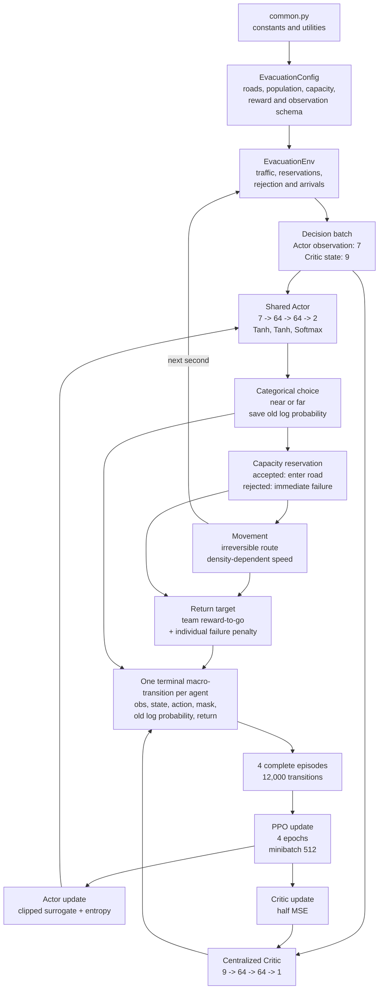

# Two-shelter capacity-aware MAPPO

This document describes the trained **two-shelter model with capacity limits**
implemented by `training.py`, `evac_env.py`, and `common.py`. It uses the exact
configuration saved in `outputs_capacity_reject_annealed`:

- 3,000 agents and 900 one-second steps;
- near road 150 m, far road 300 m, both 5 m wide;
- near shelter capacity sampled per episode from
  `{2400,2300,2200,2100,2000,1900,1800}`;
- far shelter capacity fixed at 2,400;
- `reject` capacity mode and failure penalty `-500`;
- `capacity_absolute_and_ratio` observations;
- entropy annealing from `0.05` to `0.01`;
- no road blockage during capacity training.

## 1. Architecture



This is centralized training with decentralized execution (CTDE): all 3,000
agents share one Actor; the Actor uses 7 assignment-time features; the Critic
uses a richer 9-dimensional global state; and the Critic is unnecessary during
execution. Cooperation is learned through system-wide reward-to-go, while the
individual failure term identifies rejected or timed-out decisions.

## 2. Inputs and networks

Let `N=3000`, `W(t)` be waiting agents, and `C_e^rem(t)` be remaining capacity.
The Actor receives

```math
o_t=[
\widetilde\rho_{near},\widetilde\rho_{far},W/N,
C_{near}^{rem}/N,C_{far}^{rem}/N,
\operatorname{clip}(C_{near}^{rem}/W,0,1),
\operatorname{clip}(C_{far}^{rem}/W,0,1)].
```

`remaining/N` describes absolute capacity relative to original episode demand.
`remaining/W` describes whether a shelter can absorb those still waiting.

```text
Actor (4,802 parameters)
7 inputs -> Linear(7,64) -> Tanh
         -> Linear(64,64) -> Tanh
         -> Linear(64,2) -> Softmax
         -> [P(near), P(far)]
```

Let `N_travel(t)` be agents currently on either road and `N_failed(t)` agents
already failed. The centralized Critic receives

```math
s_t=[
\widetilde\rho_{near},\widetilde\rho_{far},W/N,
N_{travel}/N,N_{failed}/N,
C_{near}^{rem}/N,C_{far}^{rem}/N,
\operatorname{clip}(C_{near}^{rem}/W,0,1),
\operatorname{clip}(C_{far}^{rem}/W,0,1)].
```

```text
Critic (4,865 parameters)
9 inputs -> Linear(9,64) -> Tanh
         -> Linear(64,64) -> Tanh
         -> Linear(64,1)
         -> V(s)
```

## 3. File and function map

### `common.py` - constants and shared graph utilities

The capacity experiment imports population, horizon, road/density/speed and
reward constants, plus PPO learning rates, clipping, epochs, minibatch size,
rollout length, gradient clipping and entropy settings.

- `haversine`: geographic distance.
- `is_inside_polygon`: point-in-polygon check.
- `find_nearest_node`: snaps coordinates to the road graph.
- `parse_osm`: parses a walkable OSM network.
- `load_evac_data`: reads shelter locations/capacities from Excel.
- `compute_shelter_distances`: multi-source shortest shelter distance.
- `compute_distances_from_node`: single-source distances and hop counts.
- `dijkstra`: shortest path to a target.
- `build_graph_index`: array-indexed graph representation.
- `build_grid_graph`: synthetic grid network.
- `build_line_graph`: center-near/far topology used here.
- `make_line_evac_data`, `make_grid_evac_data`: synthetic shelter data.
- `get_all_edges`: lists graph edges.

The OSM/grid functions are retained for later map extensions but are not called
by the current two-edge training loop.

### `evac_env.py` - capacity-aware simulation

- `EvacuationConfig`: all environment, capacity, blockage and observation
  settings.
- `EvacuationEnv.__init__`: validates config and constructs road areas.
- `_capacity_options`: resolves fixed/candidate capacity choices.
- `_validate_config`: validates modes, schemas, capacities and total capacity.
- `reset`: samples near capacity, departure times and individual speeds; clears
  reservations and episode metrics.
- `closure_active`, `edge_availability`, `observed_density`: blockage support,
  inactive in this experiment.
- `capacity_fractions`: backward-compatible edge-availability name.
- `remaining_shelter_capacity`: capacity minus reservations.
- `remaining_shelter_capacity_fractions`: remaining capacity divided by 3,000.
- `remaining_shelter_capacity_ratios`: remaining capacity divided by waiting
  demand, clipped to `[0,1]`.
- `action_mask`: in reject mode masks unavailable roads, not full shelters.
- `normalized_density`: two densities normalized/clipped to `[0,1]`.
- `observations_for`: builds the 7-D Actor observation and 9-D Critic state.
- `decision_batch`: returns agents departing now and their inputs.
- `commit`: reserves capacity for accepted agents and immediately fails excess
  assignments.
- `advance`: calculates rewards, team reward, density-dependent movement and
  arrivals for one second.
- `team_discounted_reward_to_go`: backward reward-to-go recursion.
- `finished`: horizon or all agents arrived/failed.
- `finalize`: applies timeout/failure handling and calculates all metrics.

### `training.py` - MAPPO training

- `Actor`, `Critic`: shared policy and centralized value networks.
- `PPOConfig`: dimensions and PPO hyperparameters.
- `compute_gae`: standard GAE form; terminal samples make recursion vanish.
- `_require_finite`: stops on NaN/Inf.
- `masked_probabilities`: applies physical action masks and renormalizes.
- `MAPPOAgent.__init__`: networks and two Adam optimizers.
- `MAPPOAgent.act`: probabilities, categorical sampling and old log probability.
- `MAPPOAgent.entropy_coefficient`: constant/annealed entropy coefficient.
- `MAPPOAgent.update`: advantages, four PPO epochs, losses, optimizers,
  gradient clipping and diagnostics.
- `ppo_update`: compatibility wrapper.
- `RolloutBuffer`: concatenates four complete episodes.
- `parse_args`: capacity/reject/reward/training CLI options.
- `choose_device`: CPU/CUDA selection.
- `make_new_run_directory`: timestamped output directory.
- `collect_episode`: full rollout and one macro-transition per agent.
- `_append`: diagnostic-list helper.
- `main`: constructs the 7-D/9-D setup, trains and saves all outputs.

### Evaluation files

- `evaluation_utils.py`: loads Actors/configs, evaluates Actor or fixed policy,
  optionally records decision traces, and aggregates metrics.
- `capacity_seed_convergence.py`: finds/trains compatible seeds and compares
  return, arrival time, far fraction, failures, entropy and Critic loss.
- `capacity_stress_test.py`: tests multiple capacities with four trained Actors,
  performs a fixed-probability sweep and saves resumable progress/plots/JSON.
- `capacity_demand_generalization.py`: tests 1,000-5,000 agents, proportional
  capacities and density distribution shift/input clipping.
- Other response/heatmap/animation scripts only inspect saved policies and do
  not alter MAPPO training.

## 4. MAPPO computation step by step

### 4.1 Episode sampling and density

At episode `k`,

```math
C_{near}^{(k)}\in\{2400,2300,2200,2100,2000,1900,1800\},
\qquad C_{far}^{(k)}=2400.
```

For agent `i`,

```math
\tau_i\sim\text{DiscreteUniform}\{0,\ldots,224\},
\qquad v_i^0\sim\mathcal U(1.0,1.5).
```

For road `e`,

```math
A_e=L_ew,\qquad \rho_e(t)=n_e(t)/A_e,
```

```math
\widetilde\rho_e(t)=
\operatorname{clip}(\rho_e(t)/\rho_{max},0,1),
\qquad \rho_{max}=1.0.
```

Capacity is reserved at choice time and never released:

```math
C_e^{rem}(t)=C_e-R_e(t).
```

### 4.2 Actor choice and reject processing

The Actor calculates

```math
h_1=\tanh(W_1o+b_1),\quad
h_2=\tanh(W_2h_1+b_2),\quad
\pi_\theta(a\mid o)=\operatorname{softmax}(W_3h_2+b_3),
```

then samples

```math
a_i\sim\operatorname{Categorical}(\pi_\theta),
```

and stores `a_i` and `log pi_old(a_i|o_i)`.

If `m_e` departing agents choose shelter `e`,

```math
n_e^{accepted}=\min(m_e,C_e^{rem}),
\qquad
n_e^{rejected}=\max(0,m_e-C_e^{rem}).
```

Accepted agents reserve a place and enter the road. Rejected agents fail
immediately. A full shelter remains selectable in reject mode; it is not hidden
by the capacity action mask.

If one simultaneous departure batch crosses the remaining-capacity boundary,
the code randomizes the agents and handles them individually, recalculating the
observation and log probability each time. This prevents agent-ID priority and
keeps each stored probability consistent with its actual capacity state.

### 4.3 Density-dependent movement

Movement uses the previous step's density:

```math
b_e(t-1)=\operatorname{clip}\left(
\frac{\rho_e(t-1)/\rho_{max}-\rho_{free}/\rho_{max}}
{1-\rho_{free}/\rho_{max}},0,1\right),
```

```math
q_e(t)=1-(1-0.3)b_e(t-1),
\qquad
\Delta d_i(t)=v_i^0q_{a_i}(t)\Delta t.
```

### 4.4 Travel reward and team reward-to-go

Normalized excess congestion is

```math
c_e(t)=\min\left(
\max\left(0,
\frac{\rho_e(t)/\rho_{max}-\rho_{free}/\rho_{max}}
{1-\rho_{free}/\rho_{max}}
\right),1\right).
```

An active agent receives

```math
r_{i,t}^{travel}=-0.50c_{a_i}(t)-0.01.
```

The population-normalized system reward and its discounted reward-to-go are

```math
\bar r_t=\frac{1}{N}\sum_{i\in active(t)}r_{i,t}^{travel},
```

```math
G_t^{team}=\bar r_t+\gamma G_{t+1}^{team},
\qquad \gamma=0.99.
```

### 4.5 Direct failure penalty

Define

```math
F_i=1\text{ if agent i is rejected or times out, otherwise }0.
```

Agent `i` receives the training target

```math
G_i=G_{\tau_i}^{team}-500F_i.
```

The failure term is not multiplied by `gamma^900`. Otherwise an end-of-episode
failure would be almost invisible to an early shelter choice. Averaged over
agents, its objective contribution is

```math
-500N_{failed}/N,
```

but direct assignment gives much clearer one-shot credit attribution.

The plotted diagnostic return is different:

```math
\overline R_{episode}=\frac1N\sum_i
\left(\sum_t r_{i,t}^{travel}-500F_i\right).
```

Thus `mean_episode_return_per_agent` and `mean_training_return_target` are
related but are not numerically identical. Failed agents count as 900 seconds
in the all-agent arrival-time average.

### 4.6 Terminal macro-transition and advantage

Each agent creates exactly one training sample:

```math
(o_i,s_i,a_i,m_i,\log\pi_{old}(a_i\mid o_i),G_i,done_i=1).
```

The TD residual is

```math
\delta_i=G_i+\gamma(1-done_i)V(s'_i)-V_\phi(s_i).
```

Since `done=1` and `V(s')=0`,

```math
\widehat A_i=G_i-V_{\phi_{old}}(s_i).
```

No sample bootstraps into another agent or episode. Therefore
`gae_lambda=0.95` remains in the standard interface but has no numerical effect
for these terminal transitions.

### 4.7 Rollout and advantage normalization

Four complete episodes form one batch:

```math
B=4\times3000=12000.
```

Advantages are computed once before PPO epochs and normalized over all 12,000
samples:

```math
\widehat A_i^{norm}=
\frac{\widehat A_i-\mu_{\widehat A}}
{\sigma_{\widehat A}+10^{-5}}.
```

Old log probabilities, masks, returns and normalized advantages remain fixed
during all PPO epochs.

### 4.8 Masked PPO ratio and clipped objective

Stored masks are reapplied as

```math
\pi_\theta^{mask}(a\mid o,m)=
\frac{\pi_\theta(a\mid o)m_a}
{\sum_b\pi_\theta(b\mid o)m_b}.
```

In this reject/no-blockage run, `m=[1,1]`, even when a shelter is full.

```math
r_i(\theta)=
\frac{\pi_\theta^{mask}(a_i\mid o_i,m_i)}
{\pi_{old}^{mask}(a_i\mid o_i,m_i)},
```

```math
L_i^{clip}=\min\left(
r_i\widehat A_i^{norm},
\operatorname{clip}(r_i,0.8,1.2)\widehat A_i^{norm}
\right).
```

### 4.9 Actor and Critic losses

For two actions,

```math
H(\pi)=-\sum_a\pi(a)\log\pi(a),
\qquad H_{max}=\ln2.
```

```math
\mathcal L_{actor}=-\mathbb E[L_i^{clip}]-\beta H(\pi).
```

For annealing,

```math
\beta(e)=0.05+min(e/9000,1)(0.01-0.05).
```

The centralized Critic minimizes

```math
\mathcal L_{critic}=\frac12\mathbb E[(V_\phi(s_i)-G_i)^2].
```

There is no ValueNorm/PopArt, Huber loss or clipped value loss.

### 4.10 PPO epochs and optimizer steps

Every PPO update performs four epochs. Each epoch creates one new random
permutation of all 12,000 samples, followed by 23 full minibatches of 512 and
one final minibatch of 224.

- Every transition is used exactly once per epoch, four times per update.
- Actor and Critic each receive 24 optimizer steps per epoch, 96 per update.
- Actor Adam learning rate is `1e-4`; Critic learning rate is `1e-3`.
- Both gradient norms are clipped to `0.5`.
- 12,000 episodes / 4 episodes per rollout = 3,000 PPO updates.

Diagnostics include

```math
\widehat{KL}=\mathbb E[\log\pi_{old}-\log\pi_{new}]
```

and

```math
f_{clip}=\frac1B\sum_i\mathbf1(|r_i-1|>0.2),
```

plus losses, entropy, probabilities, actions, failures, rejections, timeouts,
reservations, returns and arrival times.

## 5. One PPO update in pseudocode

```text
repeat for 4 complete episodes:
    sample near capacity; set far capacity to 2400
    sample departure times and base speeds
    while episode is not finished:
        find agents departing now
        build 7-D Actor observations and 9-D Critic states
        if the group crosses a capacity boundary:
            randomize order and process agents individually
        sample near/far and save old log probability
        reserve capacity; reject excess assignments
        move accepted agents using lagged-density speed
        record congestion/time team reward
    mark horizon timeouts as failed
    compute team reward-to-go
    add -500 directly to every failed transition
    store one terminal macro-transition per agent

concatenate 4 episodes -> 12,000 transitions
compute and normalize advantages once

repeat for 4 PPO epochs:
    randomly permute all transitions once
    split into minibatches of 512
    update Actor with clipped PPO + entropy
    update Critic with half MSE
    clip both gradient norms to 0.5
```

## 6. Presentation points

1. Capacity is reserved at decision time and never released.
2. Reject mode allows an infeasible choice, then reports it as a failed
   transition with `-500`; it does not force a safe action.
3. `remaining/N` expresses absolute scale; `remaining/waiting` expresses
   feasibility relative to outstanding demand.
4. One irreversible shelter choice produces one terminal macro-transition.
5. Team reward-to-go represents congestion externality, while direct failure
   penalty provides individual capacity credit assignment.
6. The Critic sees travelling and failed fractions that the Actor does not,
   implementing CTDE.
7. Old probabilities, masks, returns and normalized advantages stay fixed for
   all PPO epochs.
8. Capacity and blockage are trained separately; blockage is zero here.
9. Fixed-probability sweeps are evaluation baselines only and never force the
   Actor's action distribution.
