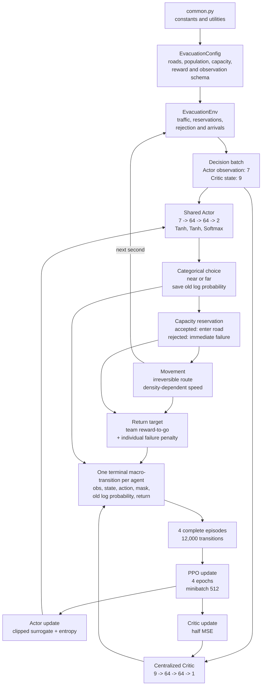
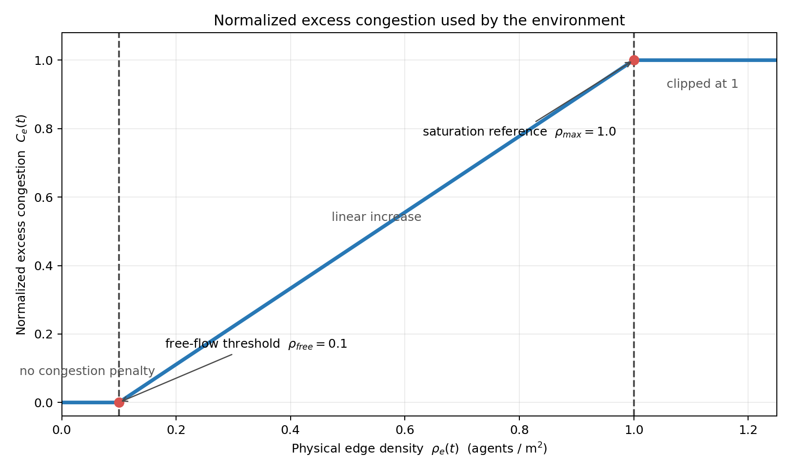
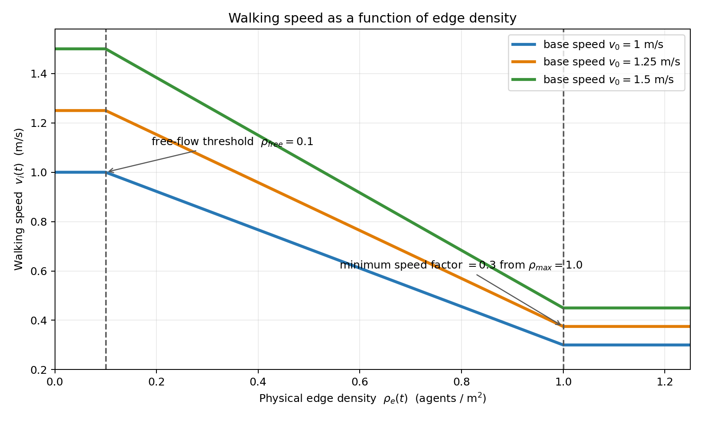

# Two-shelter capacity-aware MAPPO

This document describes the trained **two-shelter model with capacity limits**
implemented by `training.py`, `evac_env.py`, and `common.py`. It uses the exact
configuration saved in `outputs_capacity_reject_annealed`:

- 3,000 agents and 900 one-second steps;
- near road 150 m, far road 300 m, both 5 m wide;
- near shelter capacity sampled per episode from
  `{2400,2300,2200,2100,2000,1900,1800}`;
- far shelter capacity fixed at 2,400;
- `reject` capacity mode and failure penalty `-500`;
- `capacity_absolute_and_ratio` observations;
- entropy annealing from `0.05` to `0.01`;
- no road blockage during capacity training.

## 1. Architecture



This is centralized training with decentralized execution (CTDE): all 3,000
agents share one Actor; the Actor uses 7 assignment-time features; the Critic
uses a richer 9-dimensional global state; and the Critic is unnecessary during
execution. Cooperation is learned through system-wide reward-to-go, while the
individual failure term identifies rejected or timed-out decisions.

## 2. Inputs and networks

Let `N=3000`, `W(t)` be waiting agents, and `C_e^rem(t)` be remaining capacity.
The Actor receives

```math
o_t=[
\widetilde\rho_{near},\widetilde\rho_{far},W/N,
C_{near}^{rem}/N,C_{far}^{rem}/N,
\operatorname{clip}(C_{near}^{rem}/W,0,1),
\operatorname{clip}(C_{far}^{rem}/W,0,1)].
```

`remaining/N` describes absolute capacity relative to original episode demand.
`remaining/W` describes whether a shelter can absorb those still waiting.

```text
Actor (4,802 parameters)
7 inputs -> Linear(7,64) -> Tanh
         -> Linear(64,64) -> Tanh
         -> Linear(64,2) -> Softmax
         -> [P(near), P(far)]
```

Let `N_travel(t)` be agents currently on either road and `N_failed(t)` agents
already failed. The centralized Critic receives

```math
s_t=[
\widetilde\rho_{near},\widetilde\rho_{far},W/N,
N_{travel}/N,N_{failed}/N,
C_{near}^{rem}/N,C_{far}^{rem}/N,
\operatorname{clip}(C_{near}^{rem}/W,0,1),
\operatorname{clip}(C_{far}^{rem}/W,0,1)].
```

```text
Critic (4,865 parameters)
9 inputs -> Linear(9,64) -> Tanh
         -> Linear(64,64) -> Tanh
         -> Linear(64,1)
         -> V(s)
```

## 3. File and function map

### `common.py` - constants and shared graph utilities

The capacity experiment imports population, horizon, road/density/speed and
reward constants, plus PPO learning rates, clipping, epochs, minibatch size,
rollout length, gradient clipping and entropy settings.

- `haversine`: geographic distance.
- `is_inside_polygon`: point-in-polygon check.
- `find_nearest_node`: snaps coordinates to the road graph.
- `parse_osm`: parses a walkable OSM network.
- `load_evac_data`: reads shelter locations/capacities from Excel.
- `compute_shelter_distances`: multi-source shortest shelter distance.
- `compute_distances_from_node`: single-source distances and hop counts.
- `dijkstra`: shortest path to a target.
- `build_graph_index`: array-indexed graph representation.
- `build_grid_graph`: synthetic grid network.
- `build_line_graph`: center-near/far topology used here.
- `make_line_evac_data`, `make_grid_evac_data`: synthetic shelter data.
- `get_all_edges`: lists graph edges.

The OSM/grid functions are retained for later map extensions but are not called
by the current two-edge training loop.

### `evac_env.py` - capacity-aware simulation

- `EvacuationConfig`: all environment, capacity, blockage and observation
  settings.
- `EvacuationEnv.__init__`: validates config and constructs road areas.
- `_capacity_options`: resolves fixed/candidate capacity choices.
- `_validate_config`: validates modes, schemas, capacities and total capacity.
- `reset`: samples near capacity, departure times and individual speeds; clears
  reservations and episode metrics.
- `closure_active`, `edge_availability`, `observed_density`: blockage support,
  inactive in this experiment.
- `capacity_fractions`: backward-compatible edge-availability name.
- `remaining_shelter_capacity`: capacity minus reservations.
- `remaining_shelter_capacity_fractions`: remaining capacity divided by 3,000.
- `remaining_shelter_capacity_ratios`: remaining capacity divided by waiting
  demand, clipped to `[0,1]`.
- `action_mask`: in reject mode masks unavailable roads, not full shelters.
- `normalized_density`: two densities normalized/clipped to `[0,1]`.
- `observations_for`: builds the 7-D Actor observation and 9-D Critic state.
- `decision_batch`: returns agents departing now and their inputs.
- `commit`: reserves capacity for accepted agents and immediately fails excess
  assignments.
- `advance`: calculates rewards, team reward, density-dependent movement and
  arrivals for one second.
- `team_discounted_reward_to_go`: backward reward-to-go recursion.
- `finished`: horizon or all agents arrived/failed.
- `finalize`: applies timeout/failure handling and calculates all metrics.

### `training.py` - MAPPO training

- `Actor`, `Critic`: shared policy and centralized value networks.
- `PPOConfig`: dimensions and PPO hyperparameters.
- `compute_gae`: standard GAE form; terminal samples make recursion vanish.
- `_require_finite`: stops on NaN/Inf.
- `masked_probabilities`: applies physical action masks and renormalizes.
- `MAPPOAgent.__init__`: networks and two Adam optimizers.
- `MAPPOAgent.act`: probabilities, categorical sampling and old log probability.
- `MAPPOAgent.entropy_coefficient`: constant/annealed entropy coefficient.
- `MAPPOAgent.update`: advantages, four PPO epochs, losses, optimizers,
  gradient clipping and diagnostics.
- `ppo_update`: compatibility wrapper.
- `RolloutBuffer`: concatenates four complete episodes.
- `parse_args`: capacity/reject/reward/training CLI options.
- `choose_device`: CPU/CUDA selection.
- `make_new_run_directory`: timestamped output directory.
- `collect_episode`: full rollout and one macro-transition per agent.
- `_append`: diagnostic-list helper.
- `main`: constructs the 7-D/9-D setup, trains and saves all outputs.

### Evaluation files

- `evaluation_utils.py`: loads Actors/configs, evaluates Actor or fixed policy,
  optionally records decision traces, and aggregates metrics.
- `capacity_seed_convergence.py`: finds/trains compatible seeds and compares
  return, arrival time, far fraction, failures, entropy and Critic loss.
- `capacity_stress_test.py`: tests multiple capacities with four trained Actors,
  performs a fixed-probability sweep and saves resumable progress/plots/JSON.
- `capacity_demand_generalization.py`: tests 1,000-5,000 agents, proportional
  capacities and density distribution shift/input clipping.
- Other response/heatmap/animation scripts only inspect saved policies and do
  not alter MAPPO training.

## 4. MAPPO computation step by step

### 4.1 Episode sampling and density

At episode `k`,

```math
C_{near}^{(k)}\in\{2400,2300,2200,2100,2000,1900,1800\},
\qquad C_{far}^{(k)}=2400.
```

For agent `i`,

```math
\tau_i\sim\text{DiscreteUniform}\{0,\ldots,224\},
\qquad v_i^0\sim\mathcal U(1.0,1.5).
```

For road `e`,

```math
A_e=L_ew,\qquad \rho_e(t)=n_e(t)/A_e,
```

```math
\widetilde\rho_e(t)=
\operatorname{clip}(\rho_e(t)/\rho_{max},0,1),
\qquad \rho_{max}=1.0.
```

Capacity is reserved at choice time and never released:

```math
C_e^{rem}(t)=C_e-R_e(t).
```

### 4.2 Actor choice and reject processing

The Actor calculates

```math
h_1=\tanh(W_1o+b_1),\quad
h_2=\tanh(W_2h_1+b_2),\quad
\pi_\theta(a\mid o)=\operatorname{softmax}(W_3h_2+b_3),
```

then samples

```math
a_i\sim\operatorname{Categorical}(\pi_\theta),
```

and stores `a_i` and `log pi_old(a_i|o_i)`.

If `m_e` departing agents choose shelter `e`,

```math
n_e^{accepted}=\min(m_e,C_e^{rem}),
\qquad
n_e^{rejected}=\max(0,m_e-C_e^{rem}).
```

Accepted agents reserve a place and enter the road. Rejected agents fail
immediately. A full shelter remains selectable in reject mode; it is not hidden
by the capacity action mask.

If one simultaneous departure batch crosses the remaining-capacity boundary,
the code randomizes the agents and handles them individually, recalculating the
observation and log probability each time. This prevents agent-ID priority and
keeps each stored probability consistent with its actual capacity state.

### 4.3 Density-dependent movement

Movement uses the previous step's density:

```math
b_e(t-1)=\operatorname{clip}\left(
\frac{\rho_e(t-1)/\rho_{max}-\rho_{free}/\rho_{max}}
{1-\rho_{free}/\rho_{max}},0,1\right),
```

```math
q_e(t)=1-(1-0.3)b_e(t-1),
\qquad
\Delta d_i(t)=v_i^0q_{a_i}(t)\Delta t.
```

### 4.4 Travel reward and team reward-to-go

Normalized excess congestion is

```math
c_e(t)=\min\left(
\max\left(0,
\frac{\rho_e(t)/\rho_{max}-\rho_{free}/\rho_{max}}
{1-\rho_{free}/\rho_{max}}
\right),1\right).
```

An active agent receives

```math
r_{i,t}^{travel}=-0.50c_{a_i}(t)-0.01.
```

The population-normalized system reward and its discounted reward-to-go are

```math
\bar r_t=\frac{1}{N}\sum_{i\in active(t)}r_{i,t}^{travel},
```

```math
G_t^{team}=\bar r_t+\gamma G_{t+1}^{team},
\qquad \gamma=0.99.
```

### 4.5 Direct failure penalty

Define

```math
F_i=1\text{ if agent i is rejected or times out, otherwise }0.
```

Agent `i` receives the training target

```math
G_i=G_{\tau_i}^{team}-500F_i.
```

The failure term is not multiplied by `gamma^900`. Otherwise an end-of-episode
failure would be almost invisible to an early shelter choice. Averaged over
agents, its objective contribution is

```math
-500N_{failed}/N,
```

but direct assignment gives much clearer one-shot credit attribution.

The plotted diagnostic return is different:

```math
\overline R_{episode}=\frac1N\sum_i
\left(\sum_t r_{i,t}^{travel}-500F_i\right).
```

Thus `mean_episode_return_per_agent` and `mean_training_return_target` are
related but are not numerically identical. Failed agents count as 900 seconds
in the all-agent arrival-time average.

### 4.6 Terminal macro-transition and advantage

Each agent creates exactly one training sample:

```math
(o_i,s_i,a_i,m_i,\log\pi_{old}(a_i\mid o_i),G_i,done_i=1).
```

The TD residual is

```math
\delta_i=G_i+\gamma(1-done_i)V(s'_i)-V_\phi(s_i).
```

Since `done=1` and `V(s')=0`,

```math
\widehat A_i=G_i-V_{\phi_{old}}(s_i).
```

No sample bootstraps into another agent or episode. Therefore
`gae_lambda=0.95` remains in the standard interface but has no numerical effect
for these terminal transitions.

### 4.7 Rollout and advantage normalization

Four complete episodes form one batch:

```math
B=4\times3000=12000.
```

Advantages are computed once before PPO epochs and normalized over all 12,000
samples:

```math
\widehat A_i^{norm}=
\frac{\widehat A_i-\mu_{\widehat A}}
{\sigma_{\widehat A}+10^{-5}}.
```

Old log probabilities, masks, returns and normalized advantages remain fixed
during all PPO epochs.

### 4.8 Masked PPO ratio and clipped objective

Stored masks are reapplied as

```math
\pi_\theta^{mask}(a\mid o,m)=
\frac{\pi_\theta(a\mid o)m_a}
{\sum_b\pi_\theta(b\mid o)m_b}.
```

In this reject/no-blockage run, `m=[1,1]`, even when a shelter is full.

```math
r_i(\theta)=
\frac{\pi_\theta^{mask}(a_i\mid o_i,m_i)}
{\pi_{old}^{mask}(a_i\mid o_i,m_i)},
```

```math
L_i^{clip}=\min\left(
r_i\widehat A_i^{norm},
\operatorname{clip}(r_i,0.8,1.2)\widehat A_i^{norm}
\right).
```

### 4.9 Actor and Critic losses

For two actions,

```math
H(\pi)=-\sum_a\pi(a)\log\pi(a),
\qquad H_{max}=\ln2.
```

```math
\mathcal L_{actor}=-\mathbb E[L_i^{clip}]-\beta H(\pi).
```

For annealing,

```math
\beta(e)=0.05+min(e/9000,1)(0.01-0.05).
```

The centralized Critic minimizes

```math
\mathcal L_{critic}=\frac12\mathbb E[(V_\phi(s_i)-G_i)^2].
```

There is no ValueNorm/PopArt, Huber loss or clipped value loss.

### 4.10 PPO epochs and optimizer steps

Every PPO update performs four epochs. Each epoch creates one new random
permutation of all 12,000 samples, followed by 23 full minibatches of 512 and
one final minibatch of 224.

- Every transition is used exactly once per epoch, four times per update.
- Actor and Critic each receive 24 optimizer steps per epoch, 96 per update.
- Actor Adam learning rate is `1e-4`; Critic learning rate is `1e-3`.
- Both gradient norms are clipped to `0.5`.
- 12,000 episodes / 4 episodes per rollout = 3,000 PPO updates.

Diagnostics include

```math
\widehat{KL}=\mathbb E[\log\pi_{old}-\log\pi_{new}]
```

and

```math
f_{clip}=\frac1B\sum_i\mathbf1(|r_i-1|>0.2),
```

plus losses, entropy, probabilities, actions, failures, rejections, timeouts,
reservations, returns and arrival times.

## 5. One PPO update in pseudocode

```text
repeat for 4 complete episodes:
    sample near capacity; set far capacity to 2400
    sample departure times and base speeds
    while episode is not finished:
        find agents departing now
        build 7-D Actor observations and 9-D Critic states
        if the group crosses a capacity boundary:
            randomize order and process agents individually
        sample near/far and save old log probability
        reserve capacity; reject excess assignments
        move accepted agents using lagged-density speed
        record congestion/time team reward
    mark horizon timeouts as failed
    compute team reward-to-go
    add -500 directly to every failed transition
    store one terminal macro-transition per agent

concatenate 4 episodes -> 12,000 transitions
compute and normalize advantages once

repeat for 4 PPO epochs:
    randomly permute all transitions once
    split into minibatches of 512
    update Actor with clipped PPO + entropy
    update Critic with half MSE
    clip both gradient norms to 0.5
```

## 6. Presentation points

1. Capacity is reserved at decision time and never released.
2. Reject mode allows an infeasible choice, then reports it as a failed
   transition with `-500`; it does not force a safe action.
3. `remaining/N` expresses absolute scale; `remaining/waiting` expresses
   feasibility relative to outstanding demand.
4. One irreversible shelter choice produces one terminal macro-transition.
5. Team reward-to-go represents congestion externality, while direct failure
   penalty provides individual capacity credit assignment.
6. The Critic sees travelling and failed fractions that the Actor does not,
   implementing CTDE.
7. Old probabilities, masks, returns and normalized advantages stay fixed for
   all PPO epochs.
8. Capacity and blockage are trained separately; blockage is zero here.
9. Fixed-probability sweeps are evaluation baselines only and never force the
   Actor's action distribution.

## 7. Detailed clarifications

### 7.1 Actor and Critic inputs

The Actor receives a local, decision-relevant 7-dimensional observation:

1. normalized near-edge density;
2. normalized far-edge density;
3. remaining waiting fraction, `waiting_agents / 3000`;
4. remaining near-shelter capacity / 3000;
5. remaining far-shelter capacity / 3000;
6. `clip(remaining near capacity / remaining waiting agents, 0, 1)`;
7. `clip(remaining far capacity / remaining waiting agents, 0, 1)`.

The Critic receives a centralized 9-dimensional state:

1. normalized near-edge density;
2. normalized far-edge density;
3. remaining waiting fraction, `waiting_agents / 3000`;
4. travelling-agent fraction;
5. failed-agent fraction;
6. remaining near-shelter capacity / 3000;
7. remaining far-shelter capacity / 3000;
8. `clip(remaining near capacity / remaining waiting agents, 0, 1)`;
9. `clip(remaining far capacity / remaining waiting agents, 0, 1)`.

Thus, the Critic additionally sees the global travelling and failure fractions.
The Actor does not see them. This difference implements centralized training
with decentralized execution (CTDE).

### 7.2 Neural-network layers and parameter counts

Both networks are multilayer perceptrons (MLPs):

```text
Actor:  7 inputs -> Linear(7,64) -> Tanh -> Linear(64,64) -> Tanh
        -> Linear(64,2) -> Softmax -> P(near), P(far)

Critic: 9 inputs -> Linear(9,64) -> Tanh -> Linear(64,64) -> Tanh
        -> Linear(64,1) -> scalar V(s)
```

A Linear layer computes

```math
y=Wx+b.
```

Every output neuron takes a weighted sum of all inputs and adds a bias. The
matrix `W` and vector `b` are trainable. A sequence of Linear layers without a
nonlinear activation would still be equivalent to one Linear layer, so `Tanh`
is inserted between them.

`Tanh` is applied element by element:

```math
\tanh(x)=\frac{e^x-e^{-x}}{e^x+e^{-x}}.
```

It maps each hidden value to `(-1,1)` and supplies the nonlinearity required to
represent curved decision boundaries and interactions between inputs. `Tanh`
has no trainable parameters.

The Actor's final two numbers are logits. Softmax converts them to action
probabilities:

```math
\pi(a\mid o)=\frac{e^{z_a}}{e^{z_{near}}+e^{z_{far}}}.
```

The two outputs are nonnegative and sum to one. Softmax also has no trainable
parameters. The Critic has no final activation, because a value estimate must
be able to take any real value, including a large negative return.

Parameter counts include one weight for every connection and one bias for every
output unit:

| Network | Layer | Calculation | Parameters |
|---|---|---:|---:|
| Actor | Linear 7 -> 64 | `7*64 + 64` | 512 |
| Actor | Linear 64 -> 64 | `64*64 + 64` | 4,160 |
| Actor | Linear 64 -> 2 | `64*2 + 2` | 130 |
| **Actor total** | | | **4,802** |
| Critic | Linear 9 -> 64 | `9*64 + 64` | 640 |
| Critic | Linear 64 -> 64 | `64*64 + 64` | 4,160 |
| Critic | Linear 64 -> 1 | `64*1 + 1` | 65 |
| **Critic total** | | | **4,865** |
| **Combined total** | | | **9,667** |

### 7.3 Horizon, environment steps, and the absence of `step()`

The **horizon** is the maximum simulated duration of one episode. Here it is
`max_steps=900` with `dt=1` second, so one episode can last at most 900 seconds.
An agent that has not reached an accepted shelter by then is a timeout and is
marked as failed. For the all-agent arrival-time statistic, its arrival time is
represented by the horizon value of 900 seconds.

The environment does advance one simulation step, but it is not packaged in a
single Gym-style `step(action)` method. Its responsibilities are separated into:

1. `decision_batch()` -- find agents whose departure decision is due;
2. `commit(ids, actions)` -- reserve shelter space and commit their choices;
3. `advance(gamma)` -- move travelling agents and accumulate one time step of
   reward;
4. `finished()` -- test whether the episode has ended.

Therefore, `advance()` contains the main one-second state-transition role that
would normally be inside `step()`. This split supports asynchronous departure
times and careful sequential processing when a simultaneous decision batch
crosses a shelter-capacity boundary.

Agents may depart only during the first quarter of the horizon. With
`departure_window_fraction=0.25`, `max_steps=900`, and `dt=1` second, departure
steps are sampled uniformly as integers from 0 through 224. Thus all agents
depart during the first 225 seconds, or **3 minutes 45 seconds**, of the
15-minute episode. The remaining 11 minutes 15 seconds allow travelling agents
to arrive or time out; they do not create new departures.

### 7.4 Normalized excess congestion

For physical density `rho` in agents per square metre, the environment uses

```math
C_e(t)=\operatorname{clip}\left(
\frac{\rho_e(t)-\rho_{free}}{\rho_{max}-\rho_{free}},0,1
\right),
```

or equivalently

```math
C_e(t)=
\begin{cases}
0, & \rho_e(t)\le 0.1,\\
\dfrac{\rho_e(t)-0.1}{0.9}, & 0.1<\rho_e(t)<1.0,\\
1, & \rho_e(t)\ge 1.0.
\end{cases}
```



The current values are `rho_free=0.1` and **`rho_max=1.0 agents/m^2`**.
`rho_max` is a normalization and speed-saturation reference, not a hard road
capacity: the physical density can exceed 1.0, but `C_e(t)` remains 1. With the
current speed rule, that corresponds to the minimum speed factor `0.3`.

For agent `i` with its fixed base speed `v_i^0`, the movement rule is

```math
v_i(t)=v_i^0[1-(1-0.3)C_e(t-1)]
=v_i^0[1-0.7C_e(t-1)].
```

Base speed is sampled once per episode from `Uniform(1.0,1.5)` m/s. Movement
uses the previous step's density, which is why the formula contains `t-1`.



### 7.5 Expanding the team reward-to-go

For an agent departing at time `t`, the recursive equation is

```math
G_t^{team}=\bar r_t+\gamma G_{t+1}^{team}.
```

Repeated substitution gives

```math
\begin{aligned}
G_t^{team}
&=\bar r_t+\gamma G_{t+1}^{team}\\
&=\bar r_t+\gamma(\bar r_{t+1}+\gamma G_{t+2}^{team})\\
&=\bar r_t+\gamma\bar r_{t+1}+\gamma^2G_{t+2}^{team}\\
&=\bar r_t+\gamma\bar r_{t+1}+\gamma^2\bar r_{t+2}+\cdots
  +\gamma^{T-t}\bar r_T.
\end{aligned}
```

Written all the way from the first time step of a 900-step episode:

```math
G_1^{team}=\bar r_1+0.99\bar r_2+0.99^2\bar r_3+
\cdots+0.99^{898}\bar r_{899}+0.99^{899}\bar r_{900}.
```

Here `bar r_t` is the system-wide mean reward at time `t`. In practice each
agent receives the suffix beginning at its own departure time, not necessarily
at time 1.

In particular, an agent departing at step 5 receives

```math
G_5^{team}=\bar r_5+0.99\bar r_6+0.99^2\bar r_7+\cdots.
```

It does **not** start with `0.99^4 r_5`. The factor `0.99^4` appears on `r_5`
only when `r_5` is viewed from time 1 inside `G_1`. Discount exponents restart
at zero at the time from which the return is evaluated.

### 7.6 Bootstrap and the terminal macro-transition

**Bootstrapping** means using the Critic's estimate of an unobserved future
return, such as

```math
r_t+\gamma V(s_{t+1}),
```

instead of calculating the target entirely from rewards that actually occurred.
For this problem, one shelter choice is stored as one terminal macro-transition:
`done=1` and `next_value=0`. Therefore the target does not bootstrap through a
later agent decision, another agent, or the next episode. The advantage is

```math
A_i=G_i-V(s_i).
```

### 7.7 Which quantities are clipped?

There are several unrelated meanings of "clip":

| Mechanism | Actor | Critic | Meaning |
|---|---:|---:|---|
| PPO probability-ratio clipping | yes | no | limits the Actor surrogate objective to ratio `1 +/- 0.2` |
| clipped value loss | no | no | would limit movement relative to the old value prediction |
| gradient-norm clipping | yes | yes | rescales a large gradient vector to norm 0.5 |
| action mask | yes | no | removes physically unavailable actions; it is not numerical clipping |
| observation clipping | input | input | bounds normalized density/capacity ratios to `[0,1]` |

Thus, PPO ratio clipping is used only for the advantage-weighted Actor update.
The Critic uses ordinary half MSE and no clipped value loss. However, the
Critic still uses gradient-norm clipping, which is a different safety mechanism.

No clipped value loss does **not** mean that the Critic can change by an
arbitrary amount in one optimizer step. Its Adam learning rate is `1e-3`, its
gradient norm is capped at `0.5`, and updates use finite minibatches. It means
only that there is no explicit PPO-style constraint of the form
`V_new in [V_old-epsilon, V_old+epsilon]`. Multiple minibatch steps can still
accumulate a substantial change over one PPO update.

For gradient vector `g`, the implementation applies

```math
g\leftarrow
\begin{cases}
g, & \lVert g\rVert_2\le0.5,\\
g\dfrac{0.5}{\lVert g\rVert_2}, & \lVert g\rVert_2>0.5.
\end{cases}
```

This preserves the gradient direction while reducing its magnitude. It does
not clamp the network weights, outputs, or loss values.

The purpose is to prevent an unusual minibatch, a large failure advantage, or a
large Critic error from causing one disproportionately large parameter update.
Such a jump can move the policy far away from the data-generating policy or make
the value estimates oscillate. Gradient clipping acts as a safety valve: small
gradients are untouched, while only gradients whose global norm exceeds 0.5 are
rescaled. For example, a norm-10 gradient is multiplied by `0.5/10=0.05`.

### 7.8 Reject mode and PPO ratio

Reject mode does not mask a shelter just because it is full. With road blockage
disabled, the stored action mask is normally `[1,1]`, and the usual PPO ratio

```math
r_i(\theta)=
\frac{\pi_\theta(a_i\mid o_i)}{\pi_{old}(a_i\mid o_i)}
```

is calculated for near and far choices, including a choice later rejected by
capacity. The rejected choice affects learning through its return and
advantage. By contrast, an action mask concerns physical availability, such as
a road closure.

### 7.9 Entropy annealing

The Actor loss contains an entropy bonus:

```math
\mathcal L_{actor}
=-\mathbb E[\min(r_iA_i,\operatorname{clip}(r_i,0.8,1.2)A_i)]
-\beta(e)\mathbb E[H(\pi_\theta(\cdot\mid o_i))].
```

Because this loss is minimized, the negative entropy term rewards a broad action
distribution. Its coefficient decreases linearly with episode `e`:

```math
\beta(e)=0.05+min\left(\frac{e}{9000},1\right)(0.01-0.05).
```

Examples are `beta(0)=0.05`, `beta(4500)=0.03`, and `beta(e)=0.01` from episode
9000 onward. Early training therefore emphasizes exploration more strongly;
later training allows the return-driven PPO term to dominate more, while a
small entropy incentive remains. Annealing does not change the learning rate,
PPO clipping range, or probabilities directly. The coefficient is computed
when a four-episode rollout becomes ready and is held fixed throughout the four
PPO epochs of that update.

### 7.10 ValueNorm and PopArt

Neither is currently used.

- **ValueNorm** keeps running return-target mean `mu` and standard deviation
  `sigma` and trains the Critic on approximately `(G-mu)/(sigma+epsilon)`.
  Predictions are converted back to the original scale when needed. It is
  useful when target magnitudes are large or vary substantially.
- **PopArt** also normalizes changing targets, but compensates the Critic's
  final-layer weights and bias whenever the normalization statistics change.
  Consequently, the network's unnormalized predictions are preserved. It is
  particularly useful for non-stationary reward scales, curricula, or tasks
  with very different return magnitudes.

They can improve numerical stability of value learning, but they do not repair
an incorrect return definition, missing observations, or a credit-assignment
problem. Their need should be judged with value/target scale and explained
variance diagnostics.

### 7.10.1 Where the learning rate appears

After backpropagation and gradient-norm clipping, Adam applies a parameter
update. In simplified form,

```math
\begin{aligned}
m_k&=\beta_1m_{k-1}+(1-\beta_1)g_k,\\
v_k&=\beta_2v_{k-1}+(1-\beta_2)g_k^2,\\
\hat m_k&=m_k/(1-\beta_1^k),\\
\hat v_k&=v_k/(1-\beta_2^k),\\
\theta_{k+1}&=\theta_k-\alpha
\frac{\hat m_k}{\sqrt{\hat v_k}+\epsilon}.
\end{aligned}
```

Here `g_k` is the clipped gradient and `alpha` is the learning rate. The current
values are `alpha_actor=1e-4` and `alpha_critic=1e-3`. Adam's moving first and
second moments give each parameter an adaptive effective step, while `alpha`
sets the overall scale. The learning rate is therefore not part of the forward
pass or reward calculation; it controls how far parameters move after the loss
gradient has been calculated.

### 7.11 Half MSE, four PPO epochs, and diagnostics

The Critic loss is called **half MSE** because

```math
\mathcal L_{critic}=\frac12\frac1B\sum_i(V(s_i)-G_i)^2.
```

The factor `1/2` cancels the factor 2 produced by differentiating the square,
so the derivative with respect to one prediction is proportional to `V-G`.
Half MSE and ordinary MSE have the same optimum; only the gradient scale differs.

One update collects four complete episodes: `4*3000=12,000` transitions. The
same batch is then processed for **four PPO epochs**. Each PPO epoch creates a
new random permutation and uses every transition once in minibatches of 512:
23 full minibatches plus one minibatch of 224. Thus every transition is used
four times per update, and Actor and Critic each receive `24*4=96` optimizer
steps. A PPO epoch is not an environment episode.

**Diagnostics** are measurements recorded to understand and debug training;
they are not an additional optimization method. They include episode return,
training return target, arrival times, route fractions, failures, capacity
rejections, reservations, Actor/Critic losses, entropy and its coefficient,
approximate KL divergence, clip fraction, and action probabilities. They are
saved in `diagnostics.pkl` and used to identify convergence or instability.

### 7.12 Why the individual failure penalty is not averaged away

The direct capacity-failure term is constructed per transition:

```math
G_i=G_{\tau_i}^{team}-500F_i,
\qquad
F_i=\begin{cases}1,&\text{agent i failed},\\0,&\text{otherwise}.
\end{cases}
```

Only the failed agent's sample receives `-500`. The Actor loss is eventually a
mean across samples, but each sample contributes its own gradient:

```math
\nabla_\theta\mathcal L
\quad\text{contains}\quad
-\frac1B\sum_i A_i\nabla_\theta\log\pi_\theta(a_i\mid o_i).
```

Therefore, the failed sample's large negative advantage specifically reduces
the probability of **its chosen action under its observed state**. Averaging
sums and scales these sample-specific gradients; it does not first replace the
individual `F_i` values by their population mean.

The credit assignment would indeed remain poor if the implementation instead
added `-500*mean(F)` equally to every agent. That is not what it does. The
current solution is not perfect causal attribution: shared network parameters,
similar observations, and advantage normalization still couple agents. But the
individual failure vector provides much more direct credit than a team-averaged
failure penalty, while the team reward-to-go handles the congestion externality
created by collective route choices.

Advantage normalization also does not average away agent identity. First, each
sample keeps its own value

```math
A_i=G_i-V(s_i).
```

The batch statistics are then used only for an affine rescaling:

```math
\tilde A_i=\frac{A_i-\operatorname{mean}(A)}
{\operatorname{std}(A)+\epsilon}.
```

The code does not replace all advantages by `mean(A)`. It pairs every
`tilde A_i` with the same sample's `(observation_i, action_i)` and only then
averages the resulting loss terms. For two samples, the gradient resembles

```math
-\frac12[\tilde A_1\nabla\log\pi(a_1\mid o_1)
+\tilde A_2\nabla\log\pi(a_2\mid o_2)],
```

not

```math
-\operatorname{mean}(\tilde A)
\frac12[\nabla\log\pi(a_1\mid o_1)+\nabla\log\pi(a_2\mid o_2)].
```

Therefore the failed action remains identifiable during the update. A residual
credit-assignment issue does remain at a deeper causal level: capacity failure
is produced collectively, and the last agents to request a full shelter receive
the explicit penalty even though earlier agents helped fill it. Parameter
sharing can also make gradients from similar states partially cancel. The
current method solves the direct *which stored transition failed?* problem, but
not the complete counterfactual question of how responsibility should be
distributed among all earlier capacity-consuming decisions.
